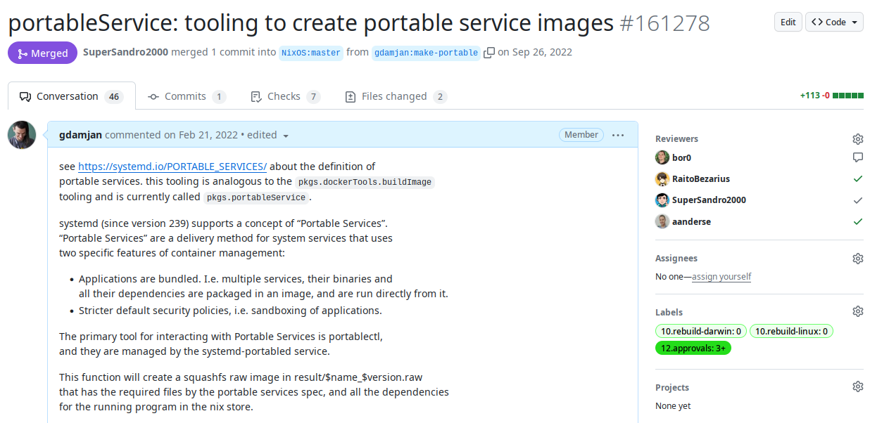
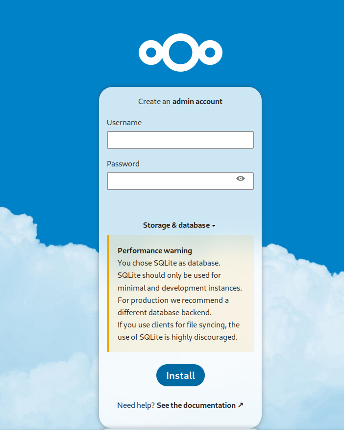

## Systemd Portable Services with <b style="color:red">Nix</b>
<span>(in 5 mins, <i>phew!</i>)</span> <!-- .element: class="fragment fade-up" -->

---
## @gdamjan

Дамјан Георгиевски

Слободен Софтвер Македонија

Hacklab Kika Скопје

Note:
вовед, кој сум шо сум, хаклаб КИКА
тоа е мојот nick на github, twitter, facebook, irc, matrix…
25 years Linux user, want to make stupid things, like learn Nix

---
## Nix

A programming language

(pure, functional, immutable, lazy)

Note:
- all the buzzwords
- it's a normal language, you know: numbers, strings, booleans, lists, attribute-sets (dicts)
- The only difference: paths, derivations

⌄⌄⌄

```nix
b = true && false # boolean

n = 1 + 2 # numbers (integers, floats are separate types)

s = "Hello" + " " + "World ${n}" # concat and templating

l = [ 1 2 3 "x" ] # lists

attrset = { key1="value1";  key2="value2"; } # like dict

f = x: x*x # functions
f 4 # call function
```
⌄⌄⌄

Some special types:
- path
- derivation

Note:
This is the magic sauce that allows Nix to build distributions

⌄⌄⌄

Haskel for children

---
## Nixpkgs

The standard library for Nix (built with Nix)

Hermetically builds reproducible software and distros (images)

Note:
- even more buzzwords
- basically you write a function or two, and you get a Linux distro with some sofware its dependencies and configuration. All software is hermetically built in sandbox, reproducible, etc..

Ok cool, so what can we make with that is Docker Images or full distros, but… I hate docker

---
## Portable Services in Systemd ❤️

1) Image of your software + all dependencies
2) Native Systemd service
    - socket activation, timers, runtime dependencies, ordering

Note:
- I love systemd (BSD people can leave now)
- images, encapsulating all your software solve a problem
- systemd has a better runtime (than docker)
  - timers, socket activation, deps and ordering

---

### Lets build Portable Service Images with Nix

---


Note:
so I decided to use my newly found Nix powers and contribute the support for building portable services with Nix

---
<!-- .slide: data-background-iframe="https://nixos.org/manual/nixpkgs/stable/#sec-pkgs-portableService" data-preload -->

Note:
the docs in Nix for the pkgs.portableService function

---
## Demo

⌄⌄⌄


⌄⌄⌄

Install the portable image on any Linux OS (with systemd >= 239)
```
sudo wget -P /var/lib/portables/ \
  github.com/gdamjan/nextcloud-service/…/nextcloud_27.1.2.raw

portablectl list

sudo portablectl attach --enable --now nextcloud_27.1.2
```

⌄⌄⌄

[](https://asciinema.org/a/ZnyefcSbwbz1dbEo9scCD9XdG?autoplay=1)

Note:
if we have 30 secs to spare

⌄⌄⌄


---
## References

* https://systemd.io/PORTABLE_SERVICES/
* https://0pointer.net/blog/walkthrough-for-portable-services-in-go.html
* https://nixos.org/manual/nixpkgs/stable/#sec-pkgs-portableService
* https://github.com/NixOS/nixpkgs/pull/161278
* https://github.com/gdamjan/nextcloud-service/

---
## Q&A

(Няма време)

<br/>
<br/>

#### @gdamjan

<small>
Дамјан Георгиевски

Слободен Софтвер Македонија, Hacklab Kika Скопје
</small>

Note:
The moral of the story is: Yes You Can!
