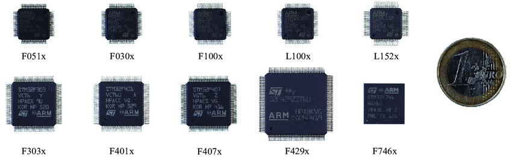
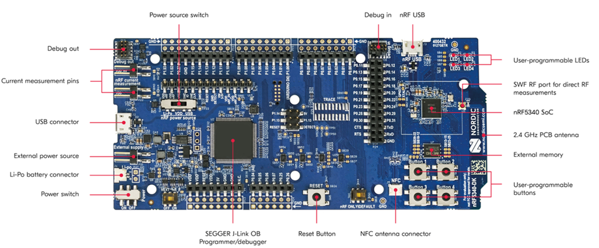
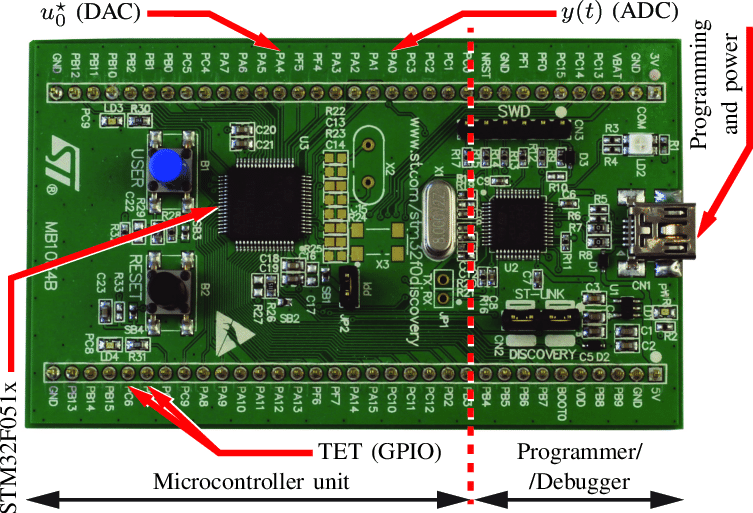
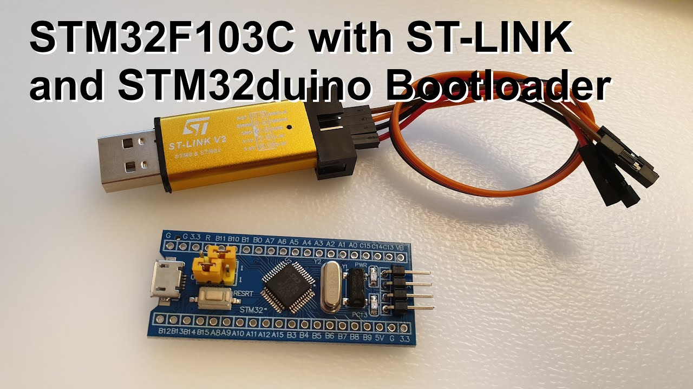
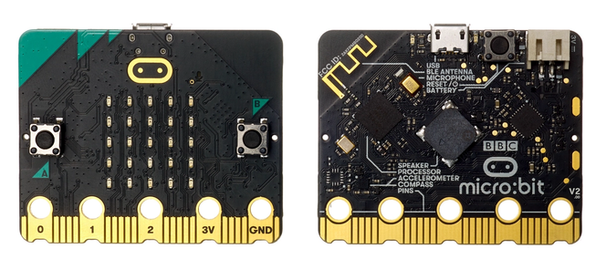
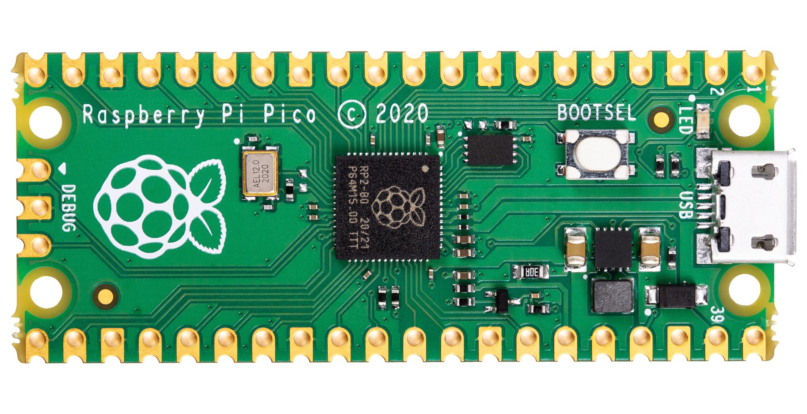

<!-- .slide: data-transition="fade" -->
## `@gdamjan`

DevOps by day

Note:
вовед, кој сум шо сум, хаклаб КИКА, НСНД
тоа е мојот nick на github, twitter, facebook, irc, matrix…

⌄⌄⌄
<!-- .slide: data-transition="fade" data-background-color="#2b2b2b" -->

## `@gdamjan`

Hacking by Night

---
## `rust-embedded`

што, зошто и како

Note:
Што да очекуваме…
Ќе збориме за употребата на Rust за embedded програмирање, зашто е подобар, како се користи,
пред сѐ во хобистички услови,
нема да разгледуваме large-scale production системи
Прво малку вовед, а потоа практична вежба.
Ова е multiple-choice настан, така да во еден момент ќе треба да избереме дали сакаме да навлеземе длабоко во детали или широко-но-плитко во разни features.

---
## Embedded Dev 101

(на кратко да се потсетиме што е embedded)

Note:
што е еmbedded (и за кој embedded нема да збориме, кернел, apliances)
потсетување за терминологија …

⌄⌄⌄

Note:
процесор со меморија, flash, adc, dac - додај струја и работи независно

⌄⌄⌄

⌄⌄⌄

⌄⌄⌄

⌄⌄⌄

⌄⌄⌄

⌄⌄⌄

instruction set architecture (ISA)

vs

microarchitecture

vs

core (cpu)

vs

system-on-a-chip (SOC)

Note:
https://en.wikipedia.org/wiki/Instruction_set_architecture
https://en.wikipedia.org/wiki/Comparison_of_instruction_set_architectures
https://en.wikipedia.org/wiki/Microarchitecture
https://en.wikipedia.org/wiki/ARM_Cortex-A53

- квиз прашања: како се вика ARM ахитектурата, а како ESP

⌄⌄⌄

---
## `rust-embedded`

што, зошто и како

⌄⌄⌄
## Што

нема OS - Rust за ARM/Risc-V/x86 - нема alloc - cross-compiler

---
## `Зошто rust`

⌄⌄⌄
### Low-level, system language

- no runtime
- no overhead
- no os

Note:
дека ни се може

⌄⌄⌄
### Better than C/C++

- more expressive
- better error handling
- better typing
- safe (no undefined behaviour)

Note:
дека е подобар

⌄⌄⌄
### Ownership

[Example](https://depth-first.com/articles/2020/01/27/rust-ownership-by-example/)

Note:
just a short detour what/how ownership in Rust is/works

⌄⌄⌄
### Ownership: what does it mean for embedded

⌄⌄⌄
### Ecosystem

[crates.io](https://crates.io)

---
## Workshop time

- [`rustup`](https://rustup.rs/)
- `cargo init`
- `cargo run`
- `cargo embed` (probe-rs)
- hello-world
⌄⌄⌄

svd - System View Description

⌄

pac - Peripheral Access Crate

⌄

HAL - Hardware Abstraction Layer

⌄

BSP - Board Support Package

Note:
some rust embedded terminology
https://docs.rust-embedded.org/discovery/microbit/04-meet-your-hardware/terminology.html

⌄⌄⌄
### [nRF5340-DK](https://www.nordicsemi.com/Products/Development-hardware/nRF5340-DK)

⌄⌄⌄
- led on
- blink led,
- blink led, delay
- print to serial
- print to rtt/defmt
- async
- usb hid
- bluetooth
- wifi, tcp/ip
- mqtt
- borrow checker
- gdb

⌄⌄⌄
### Rust(llvm) target triple

`<arch>-<vendor>-<sys>-<env>`

- `arch = x86_64, i386, arm,…`
- `sub = [ex. arm] v5, v6, v7m,…`
- `vendor = [optional) pc, apple, ibm,…`
- `sys = none, linux, win32, darwin,…`
- `env = eabi, gnu, elf,…`

---
## Q&A

---
## Ресурси

* [Rust by example](https://doc.rust-lang.org/rust-by-example/)
* [docs.rust-embedded.org](https://docs.rust-embedded.org/) · [Book](https://docs.rust-embedded.org/book/) ·
  [Discovery](https://docs.rust-embedded.org/discovery/)
* [awesome-embedded-rust](https://github.com/rust-embedded/awesome-embedded-rust)
* https://probe.rs/
* https://rustup.rs/
* IRC channel #rust-embedded on libera.chat (matrix)
* https://embassy.dev/
* https://www.youtube.com/playlist?list=PLIWc_eqdlTFGupmZO3vQ7mVMkSz0f8Ym9

⌄⌄⌄
## Off-topic Ресурси

* [Kicad](https://www.kicad.org/)
* [Fritzing](https://fritzing.org/)
* [LibrePCB](https://librepcb.org/)
* [Wokwi](https://wokwi.com/rust) - Simulate IoT Projects in Your Browser
