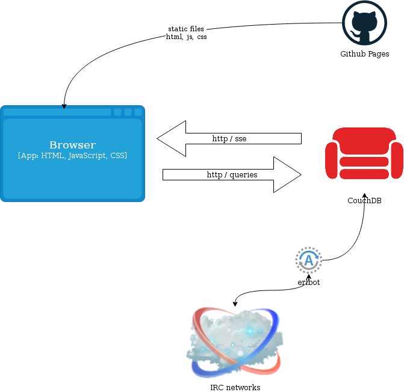

## @gdamjan

DevOps by day

Note:
вовед, кој сум шо сум, хаклаб КИКА, НСНД
тоа е мојот nick на github, twitter, facebook, irc, matrix…

⌄⌄⌄
## irclog

https://irc.softver.org.mk/

Notes:
пред 10тина години тргнав да пишувам erlang irc bot, кој што ќе ја чува
историјата на irc каналот. па потоа се појави и потребата за frontend

⌄⌄⌄

---
## Svelte

<small>[https://svelte.dev/docs/introduction]</small>

Notes:
- toolkit за... (not really framework)
- components - isolated, composable, encapsulated

---
## _not_ SvelteKit

(more on that later)

Note:
ќе збориме покасно, но повеќе е како React и Nextjs

---
## Let's see how it looks

(demo time)

Note: composable компоненти (што сакаме од нив: )
пример (setup, vite, App.svelte, Footer.svelte)

⌄⌄⌄
## Scaffold

<pre><code>yarn create vite beerjs-demo --template svelte-ts
cd beerjs-demo
yarn
yarn dev
</code></pre>

⌄⌄⌄
##
<pre><code>.
├── index.html
├── package.json
├── public
│   └── vite.svg
├── README.md
├── src
│   ├── app.css
│   ├── App.svelte
│   ├── assets
│   │   └── svelte.svg
│   ├── lib
│   │   └── Counter.svelte
│   ├── main.ts
│   └── vite-env.d.ts
├── svelte.config.js
├── tsconfig.json
├── tsconfig.node.json
├── vite.config.ts
└── yarn.lock
</code></pre>

⌄⌄⌄
## code .

Notes:
vscode extension supported
let's add a components with css

---
## Reactivity

Counter

⌄⌄⌄
## Reactivity enhanced

- Svelte stores
- let's create a demo hash router

Notes:
variables don't scale
https://learn.svelte.dev/tutorial/readable-stores

⌄⌄⌄
## Reactivity enhanced

- let's create a demo hash router

---
## Tooling

- vscode extension
- vite
- svelte-check

---
## Typescript

yes!

Notes:
just works with the vscode extension

---
## Under the hood

it's a compiler,
  not a templating language

Note:
example how it won't allow invalid html/css

---
## Svelte vs SvelteKit revisit

Notes:

---
## References

<small>[https://svelte.dev/docs/introduction]</small>

<small>[MDN Svelte](https://developer.mozilla.org/en-US/docs/Learn/Tools_and_testing/Client-side_JavaScript_frameworks/Svelte_getting_started)</small>

---
## Q&A

Note:
Ве поканувам да ми помогнете да со подобрувања на irclog
